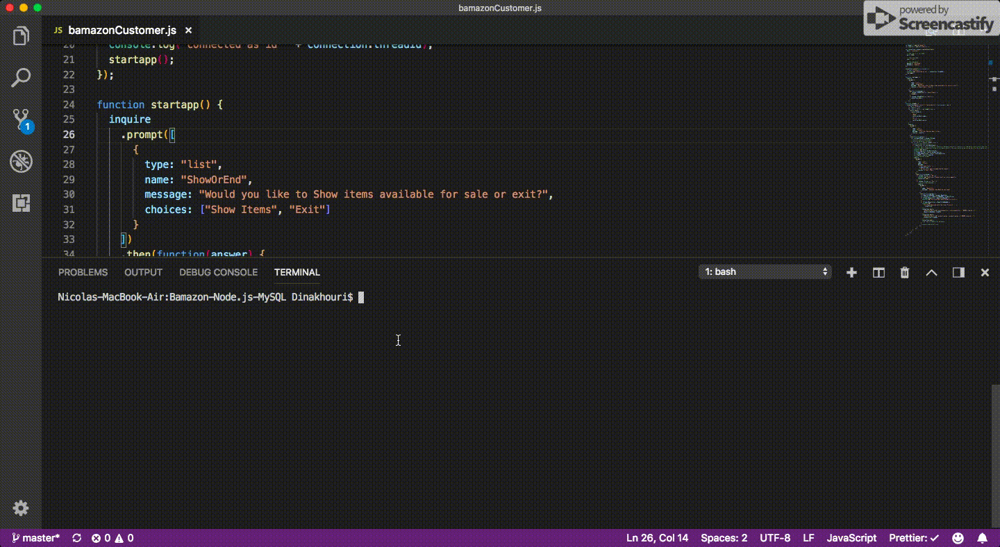
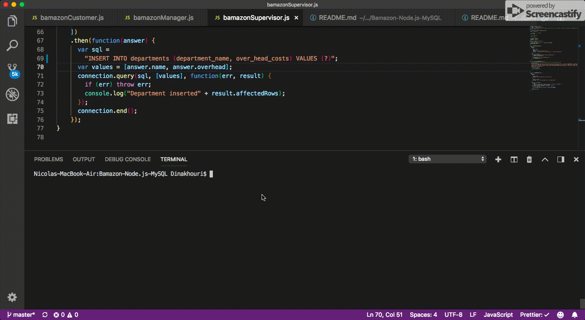

# Bamazon-Node.js-MySQL

### Overview

In this app I'm creating an Amazon-like storefront using MySQL and Node.js . The app will take in orders from customers and deplete stock from the store's inventory.As it also tracks product sales across your store's departments and then provides a summary of the highest-grossing departments in the store.

## How to use it :

### Bamazon Customer

- Running this application will first display all of the items available for sale. Include the ids, names, and prices of products for sale.
- The app should then prompt users with two messages:

1. The first should ask them to pick the product they would like to buy.
2. The second message will ask how many units of the product they would like to buy.

- Once the customer has placed the order, the application will check if the store has enough of the product to meet the customer's request.
- If the store has enough quantity in stock, the app will fulfill the order and update the data.
  

### Bamazon Manager

- Running this application will ist a set of menu options:

* View Products for Sale

* View Low Inventory

* Add to Inventory

* Add New Product

### Bamazon Supervisor

- Running this application will list a set of menu options:

* View Product Sales by Department

* Create New Department

